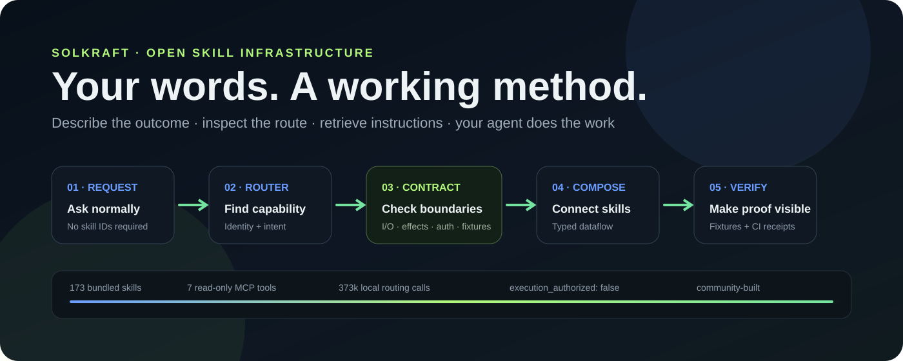
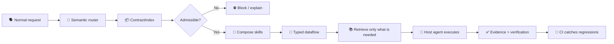

<!-- solkraft-doc-sync: contract-aware-v1 | validation-100k-100-family | 2026-10 -->

# SolKraft

<div align="center">



### ✳️ The open skill OS for agents

**Route normal-language requests to the right reusable capabilities — with contract-aware selection, typed composition, and CI-visible verification.**

[](https://github.com/halthinks/SolKraft/actions/workflows/tests.yml)
[](https://github.com/halthinks/SolKraft/actions/workflows/advanced-contract-benchmark.yml)
[](https://halthinks.github.io/SolKraft/)
[](https://www.python.org/)
[](docs/REMOTE_MCP.md)
[](LICENSE)

**[Open the Console](https://halthinks.github.io/SolKraft/)** ·
**[Browse 173 Skills](solkraft/skillpacks)** ·
**[Connect an Agent](docs/REMOTE_MCP.md)** ·
**[Contribute](CONTRIBUTING.md)** ·
**[Contributors](https://halthinks.github.io/SolKraft/contributors.html)** ·
**[Support](https://github.com/halthinks/SolKraft/issues/new?template=support_request.yml)**

</div>

---


<!-- BEGIN SOLKRAFT CURRENT SYSTEM -->
## Current SolKraft system — October 2026

- Contract-aware routing uses semantic capability identity plus machine-readable `contract.yaml` metadata for typed inputs/outputs, namespaced effects, capability/resource requirements, declarative verification, provenance, trust, and exact digests.
- Public REST, MCP, and CLI routing default to **hardened** policy. Opaque or otherwise inadmissible capabilities fail closed; the Python library stays compatibility-oriented unless stricter policy is requested.
- SolKraft is advisory and non-executing. Runtime authority remains with the host and `execution_authorized` remains `false`.
- The compact `ContractIndex` supplies routing/API/MCP/docs metadata without loading every full `SKILL.md` body into the hot path.
- Read-only MCP tools: `search_skills`, `route_request`, `get_skill`, `get_skill_resource`, `get_selection_graph`, `get_skill_contract`, and `get_contract_index`.
- Reusable CI and pre-PR contribution validation share contract/schema, routing, packaging, installed-MCP, index/hardening, and evidence gates.
- Latest local acceptance: **100,000 / 100,000** unique 250-word requests passed with **100 ask families per skill**, **100% eligible target recall**, **100% hardened blocking**, and **100% consequential-boundary correctness**; no explicit skill IDs were injected.
- The public Validation display is a clearly labeled **recorded reenactment**, not live browser CI.

<!-- END SOLKRAFT CURRENT SYSTEM -->

## ⚡ One request → the right capability stack



SolKraft is deliberately **not** another opaque tool bag. It gives agents a compact operating layer for discovering, selecting, composing, and inspecting reusable procedures while keeping runtime authority with the host.

| Layer | What SolKraft adds |
|---|---|
| 🧭 **Routing** | Semantic capability identity, compound-request decomposition, exclusions, and whole-route repair |
| 📜 **Executable contracts** | Typed inputs/outputs, namespaced effects, required capabilities/resources, verification, and pass/fail fixtures |
| 🧩 **Composition** | Typed producer → consumer relationships and dependency-aware route validation |
| 🔒 **Boundaries** | Hardened public defaults, explicit blocked states, and `execution_authorized: false` |
| 🔎 **Selective retrieval** | Compact metadata first; full `SKILL.md` only when a capability earns its place |
| 🧪 **Evidence** | Reusable CI, contract fixture execution, packaging checks, installed MCP checks, and the 100k routing benchmark |

### 🚀 Why it feels different

- **Ask normally.** No need to memorize skill IDs for ordinary use.
- **Inspect why.** Routes carry reasons, contracts, requirements, and unresolved work.
- **Compose safely.** Skills can connect through typed inputs and outputs instead of loose prompt glue.
- **Keep authority external.** SolKraft recommends capabilities; your host decides what it can actually do.
- **Make regressions loud.** Contracts and routing expectations run in CI instead of living as prose nobody rechecks.
- **Grow in public.** Code, testing, research, docs, issue discovery, and project-shaping ideas all count as contribution.

## 🌟 Community spotlight

### Cozy · [@Cozy2054934](https://x.com/Cozy2054934) · ★★★★★

**Contributor 001 · project-shaping idea work**

Cozy’s contribution helped push the project from descriptive skill metadata toward **executable capability contracts**: declarations the router can reason about and CI can continuously test. That idea now shows up in Contract v1 fixture execution, contribution gates, safer capability selection, and visible regression failures.

> Nice—keep the skill contract executable: declare inputs, side effects, auth scope, and a few pass/fail fixtures, then run it in CI. That makes capability selection safer and regressions visible.

> The skill layer is most useful when each skill declares inputs, side effects, auth scope, and a test contract. Then an agent can select capabilities without treating every tool as an opaque superpower

— **Cozy · [@Cozy2054934 on X](https://x.com/Cozy2054934)**


[See the full Contributors page →](https://halthinks.github.io/SolKraft/contributors.html) ·
[Badge legend →](https://halthinks.github.io/SolKraft/contributors.html#badge-legend) ·
[Contributions showcase →](https://halthinks.github.io/SolKraft/contributions.html) ·
[Public nominations archive →](https://halthinks.github.io/SolKraft/nominations.html) ·
[Nominate a contributor →](https://github.com/halthinks/SolKraft/issues/new?template=contributor_nomination.yml)

## 🗺️ Project map

| Go here | For |
|---|---|
| [`solkraft/routing.py`](solkraft/routing.py) | Advisory request → route orchestration |
| [`solkraft/contract_schema.py`](solkraft/contract_schema.py) | Contract v1 validation rules |
| [`solkraft/contract_fixtures.py`](solkraft/contract_fixtures.py) | Executable selection + policy fixtures |
| [`solkraft/contract_index.py`](solkraft/contract_index.py) | Compact capability metadata and indexes |
| [`solkraft/skillpacks/`](solkraft/skillpacks) | The bundled skill operating layer |
| [`scripts/local_ci.py`](scripts/local_ci.py) | Canonical local/reusable verification gate |
| [`VALIDATION.md`](VALIDATION.md) | What has actually been tested and what it means |
| [Live Console](https://halthinks.github.io/SolKraft/) | Browse, inspect, connect, and replay validation |
| [Contributors](https://halthinks.github.io/SolKraft/contributors.html) | Community impact and recognition |
| [Contributions Showcase](https://halthinks.github.io/SolKraft/contributions.html) | Filterable high-level outcomes contributors helped create |
| [Nominations Archive](https://halthinks.github.io/SolKraft/nominations.html) | Public nomination and recognition history |
| [Support](https://github.com/halthinks/SolKraft/issues/new?template=support_request.yml) | Setup, routing, usage, docs, or bug help |

---


New here? Follow [Connect your agent](docs/REMOTE_MCP.md). Want to teach it a new method? Follow [the complete skill contribution process](docs/SKILL_CONTRIBUTIONS.md), including graph registration, automatic-selection examples, the 100,000-request regression, and local package/MCP verification. Both have animated walkthroughs in the console.

Explore the [interactive connection walkthrough](https://halthinks.github.io/SolKraft/#setup-lab) or read [the complete Render, API, MCP, plugin, and platform guide](docs/CONNECTIONS.md). Build and verify locally with `python -m scripts.local_ci`; pull requests use the same reusable GitHub CI gate, and skill contributors can run the full preflight workflow before opening a PR.

[Skill-contract architecture roadmap](docs/SKILL_CONTRACT_ROADMAP.md) · [6-sprint implementation plan](docs/SKILL_CONTRACT_6_SPRINT_PLAN.md) · [Machine-readable roadmap](roadmap/skill-contracts-v1.json) · [Machine-readable sprint plan](roadmap/skill-contract-sprints-v1.json)

**An open skill OS for agents.** Find the right procedure, compose multi-step work, and retrieve only the instructions needed for the next step. SolKraft provides a searchable catalog, advisory router, REST API, and Model Context Protocol (MCP) server.

[Open the console](https://halthinks.github.io/SolKraft/) · [Browse skills](solkraft/skillpacks) · [Get support](https://github.com/halthinks/SolKraft/issues/new?template=support_request.yml) · [Nominate a contributor](https://github.com/halthinks/SolKraft/issues/new?template=contributor_nomination.yml) · [API quickstart](#run-the-api)

## What it does

SolKraft indexes ordinary `SKILL.md` folders plus optional machine-readable `contract.yaml` sidecars. Search and routing use compact metadata for semantic fit, inputs/outputs, effects, capability/resource requirements, trust, typed dataflow, and verification contracts; agents fetch a selected skill body only when useful. SolKraft never executes a skill or grants authority. The host agent remains in control.

- **REST API:** authenticated search, routing, contract schema/validation, contract metadata, portable contract import/export, retrieve, and refresh endpoints.
- **MCP:** read-only search, routing, skill retrieval, contract metadata, and compact contract-index tools with standard read-only/idempotent annotations.
- **Contracts:** typed inputs/outputs, namespaced effects, capability/resource requirements, declarative verification checks, provenance, trust, and digest binding.
- **Reusable CI:** one local/GitHub validation path for ordinary PRs and pre-PR skill contribution builds.
- **GitHub Pages console:** browse and inspect the full bundled catalog offline, then connect an API to compose routes. API keys stay in memory and are never saved.
- **Local-first:** run it on your machine or deploy a free API instance yourself.

This release bundles **173 owner-contributed and licensed skills** across software, research, science, data, business, engineering, writing, and general workflows. The live API can additionally scan skill roots you choose.

## Install the Codex plugin

Requires Python 3.11+ and a Codex client with plugin support:

```sh
python -m pip install "git+https://github.com/halthinks/SolKraft.git"
codex plugin marketplace add halthinks/SolKraft --sparse .agents/plugins --sparse plugins/solkraft
codex plugin add solkraft@solkraft
```

Start a new session in the same environment, with `solkraft` on PATH. The plugin supplies the MCP connection and compact guidance for natural skill use. The host chooses useful procedures, retrieves them, and does the work using its existing tools. See [plugin installation and verification](docs/PLUGIN.md), [ChatGPT and other clients](docs/CLIENTS.md), and [the downloadable plugin](https://halthinks.github.io/SolKraft/downloads/solkraft-plugin.zip).

## Try it locally

Requires Python 3.11 or newer.

```powershell
py -m venv .venv
.venv\Scripts\Activate.ps1
python -m pip install -e .
$env:SOLKRAFT_API_KEY = "replace-with-a-long-random-secret"
python -m solkraft api
```

Open `http://127.0.0.1:8765/docs` for interactive API documentation. Set `SOLKRAFT_SKILL_ROOTS` to additional directories (semicolon-separated on Windows, colon-separated elsewhere). Added roots are read-only inputs; never point them at private directories when operating a public service.

## Run the API

Every `/v1/*` and `/mcp` request needs `Authorization: Bearer <key>`. `/healthz` is public. The browser console has a key field; the key is held only in memory for the current page session.

| Endpoint | Purpose |
|---|---|
| `GET /healthz` | Liveness check |
| `GET /v1/skills?q=...&limit=20` | Search skill metadata |
| `GET /v1/skills/{id}` | Fetch one selected `SKILL.md` |
| `GET /v1/skills/{id}/contract` | Fetch compact contract metadata without loading the skill body |
| `GET /v1/contracts` | Filter compact contracts by effect, capability, I/O, or trust |
| `GET /v1/contract-schema` | Fetch the portable Contract v1 JSON Schema |
| `POST /v1/contracts/validate` | Validate Contract v1 metadata |
| `GET /v1/skills/{id}/contract/export` | Export a portable declaration when effects are known |
| `POST /v1/contracts/import` | Validate a portable declaration as untrusted metadata |
| `POST /v1/route` | Return an ordered advisory route; public surfaces default to hardened contract policy |
| `POST /v1/refresh` | Re-index configured roots and incrementally refresh contract metadata |
| `/mcp` | MCP Streamable HTTP transport |

Example:

```sh
curl -H "Authorization: Bearer $SOLKRAFT_API_KEY" \
  "https://YOUR-SERVICE.onrender.com/v1/skills?q=repository%20test"
```

The route uses the included SolForge graph plus compact contracts. Public REST, MCP, and CLI routing default to hardened mode: opaque skills fail closed, known-inadmissible candidates are filtered before composition, whole routes are validated, typed producer/consumer relationships can participate in composition, and unresolved requirements remain visible. Results explicitly carry `execution_authorized: false`; routing is a suggestion, not an agent-policy hook.

## Free hosting

[Deploy your API on Render](https://render.com/deploy?repo=https://github.com/halthinks/SolKraft)

The included `render.yaml` is a starting point for Render's free Python web service. Connect this GitHub repository, set a long random `SOLKRAFT_API_KEY` in the service environment, and deploy. Follow the [interactive Render walkthrough](https://halthinks.github.io/SolKraft/#setup-lab). The GitHub Pages workflow uploads the console generated by the local build gate (Settings → Pages → GitHub Actions).

Render's free web services sleep after 15 minutes without inbound traffic and can take about a minute to wake. The free tier is intended for hobby/testing use, so expect cold starts and service limits; it is not an always-on production SLA. The static Pages console is free and remains available while the API sleeps. See [Render's current free-service details](https://render.com/docs/free).

Do not publish a shared API key in frontend source or commit secrets. A browser key is visible to the person using that browser; use personal keys for personal deployments. Public shared deployments need an operator-managed auth, rate limiting, monitoring, and an explicit privacy policy. SolKraft does not relay model API calls and has no paid dependency.

## Contribute

See [AGENTS.md](AGENTS.md) for the full architecture, contracts, safety boundaries and agent workflow. Read [CONTRIBUTING.md](CONTRIBUTING.md), search existing [issues](https://github.com/halthinks/SolKraft/issues), then open a focused issue or pull request. The issue chooser includes bug reports and skill proposals. Sensitive vulnerabilities belong in [SECURITY.md](SECURITY.md), not a public issue.

```sh
python -m pip install -e ".[dev]"
python -m scripts.local_ci

# New skill contribution before opening a PR:
python -m scripts.preflight_contribution contributions/your-skill.json
```

## License

Project code is MIT. Bundled third-party skills retain their own MIT or Apache-2.0 licenses. See [LICENSE](LICENSE). Bundled skill provenance and license notes are tracked in [`THIRD_PARTY_NOTICES.md`](THIRD_PARTY_NOTICES.md).

## Use the operating system

[Connect an agent through MCP, API, or CLI](docs/CLIENTS.md), including shell access from Grok CLI.

Agents read `AGENTS.md`, apply `ENGINEERING_CONSTRAINTS_V1.json` for engineering work, and load relevant skill procedures at task start and stage changes. The shared composer understands ordered actions, exclusions, quoted context, explicit IDs, and established session context. The graph supplies conditional relationships; skills carry the procedures and supporting resources.

Route requests accept optional `skills` and `context` fields. Responses retain `selection_trace` and `unselected_requested_stages`. Retrieve a supporting text resource at `GET /v1/skills/{id}/resources/{relative-path}` or MCP `get_skill_resource`. Load only the entrypoints and resources needed for the current stage.

### CLI and graph

```sh
solkraft search "repository tests"
solkraft route "Inspect the repository, implement the fix, then run regression tests" --max-skills 50
solkraft get solforge-workflow-software-test
solkraft resource solforge references/matcher-guide.md
solkraft graph
```

`GET /v1/graph` and MCP `get_selection_graph` expose the portable graph and conditional follow-ups. Configure `SOLKRAFT_ALLOWED_HOSTS` for a custom hosted MCP domain; Render's assigned hostname is recognized automatically. The repository includes a Render deployment blueprint; deploy it from your Render account to obtain the API URL.

The discovery graph covers all 173 bundled skills. Its 121-workflow semantic core carries 213 conditional relationships; other catalog nodes support discovery and explicit selection without fabricated dependencies. Operator-mounted skill roots join the same discovery graph. See [validation evidence](VALIDATION.md) for the regression suite, reproducible routing battery, and its limits.

### Discover installed skills locally

Use `solkraft search "your objective" --installed`, `solkraft route "your objective" --installed`, or `solkraft mcp --installed` to include `~/.codex/skills`, `~/.agents/skills`, and `~/.codex/plugins/cache`. Identical entrypoints are collapsed; different versions receive source-qualified IDs. Bundled workflow IDs remain stable. `solkraft api --installed` requires a localhost bind. Public deployments serve the redistributable bundle by default.

## Use the console

The [public console](https://halthinks.github.io/SolKraft/) is a browser for procedures and an interface to the router. Browse skills in pages of 12, 24, or 48; search descriptions; inspect a procedure and its supporting files; then copy its instructions for your agent. No API connection is needed for the bundled catalog or worked example.

The worked bug-fix example contains parser output generated from the same bundled Python engine used by the service. It shows ordered stages, reasons, exclusions, and links to the selected procedures. It is labelled as precomputed evidence, not a live request. Connect your own server to compose arbitrary objectives through the API.

The animated vertical walkthrough explains three distinct layers: SolForge selects relevant skills using the parser and graph; capability-preserving execution guides the host agent's dependency management, recovery, and verification; specialist skills supply the method for each stage. The interactive setup cards explain Render, REST, MCP, and the local plugin. The UI retrieves and explains procedures. Your host agent performs the actual work. See [the UI and parser guide](docs/UI_GUIDE.md) and [connection guide](docs/CONNECTIONS.md).
